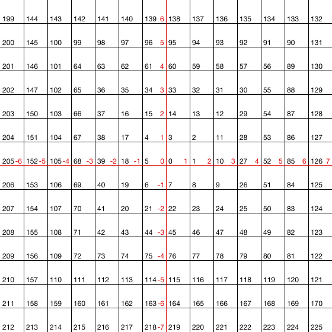

# zero-indexed-ulam-spiral



This JavaScript library provides two functions for operating with the values of a zero-indexed [Ulam Spiral](https://en.wikipedia.org/wiki/Ulam_spiral#Construction):

```js
import getLatticeCoordinatesFor from 'zero-indexed-ulam-spiral/getLatticeCoordinatesFor'

console.log(getLatticeCoordinatesFor(31))
// > [2, 3]
```

```js
import getSpiralIndexForCoordinates from 'zero-indexed-ulam-spiral/getSpiralIndexForCoordinates'

console.log(getSpiralIndexForCoordinates([5, 6]))
// > 133
```

### Why is this zero indexed?

Zero indexing is the most popular convention for indexes in programming. Either way, it’s really easy to transform.

### What about primes?

This library is about operating with the [pairing function](https://en.wikipedia.org/wiki/Pairing_function) from the lattice to the spiral and back. If you want to plot primes on top of it, it should be simple enough.

And yes, the diagonal stripe prime patterns always appear, no matter what the starting value is :)

## Installation

```
yarn add zero-indexed-ulam-spiral
```

## License

MIT
